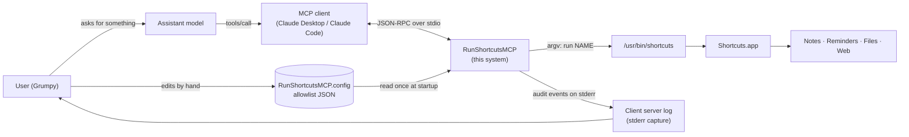
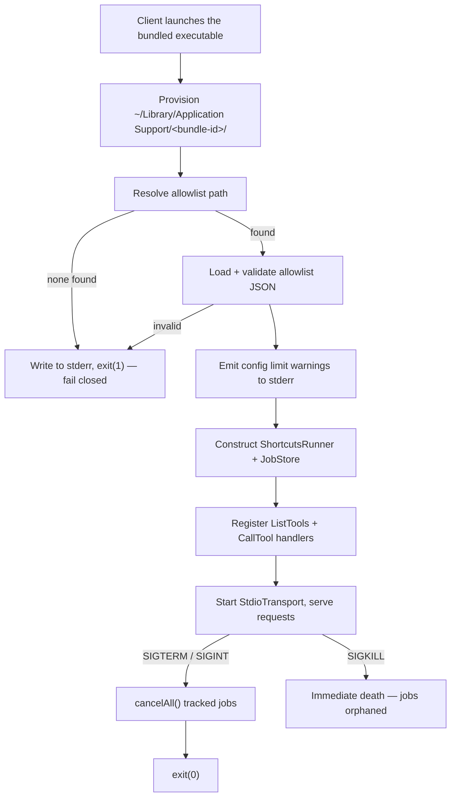
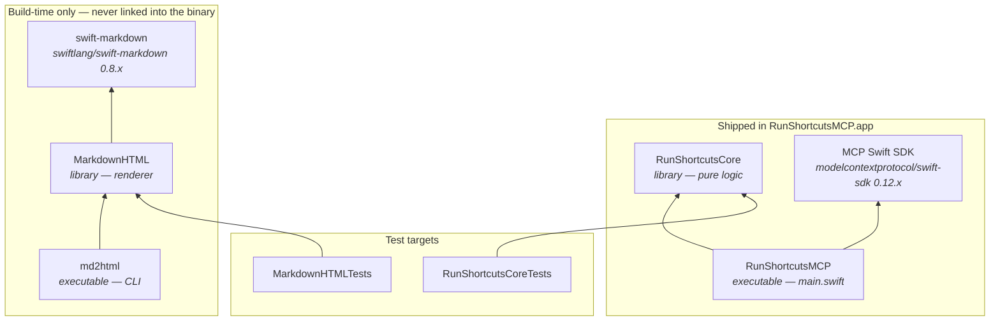
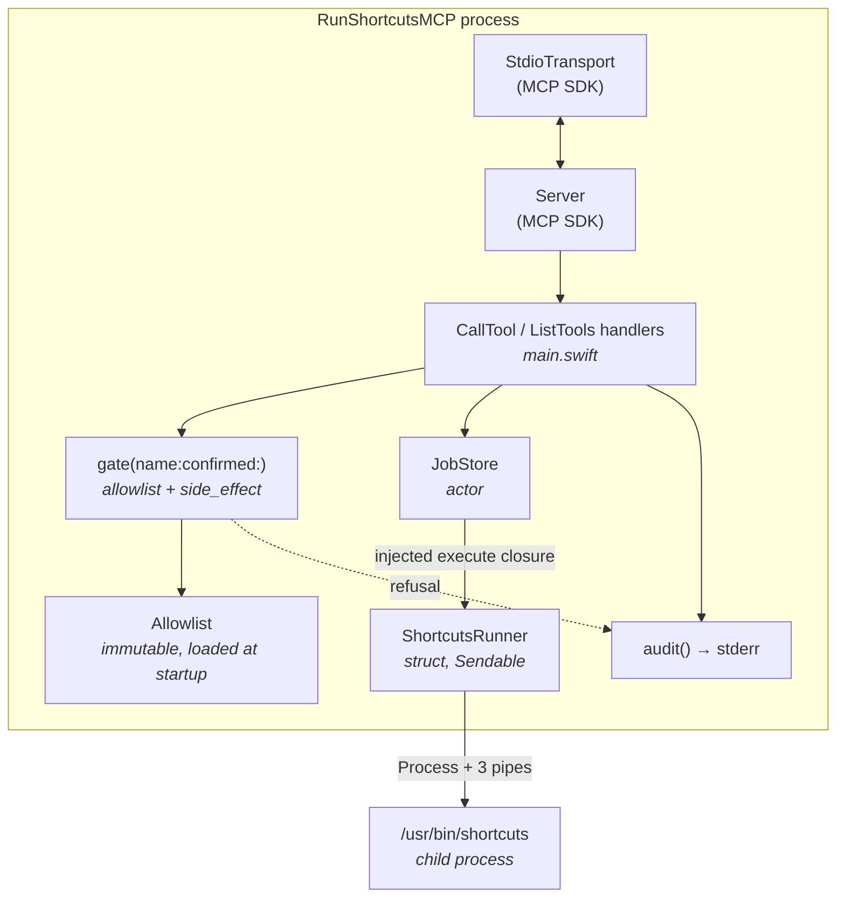
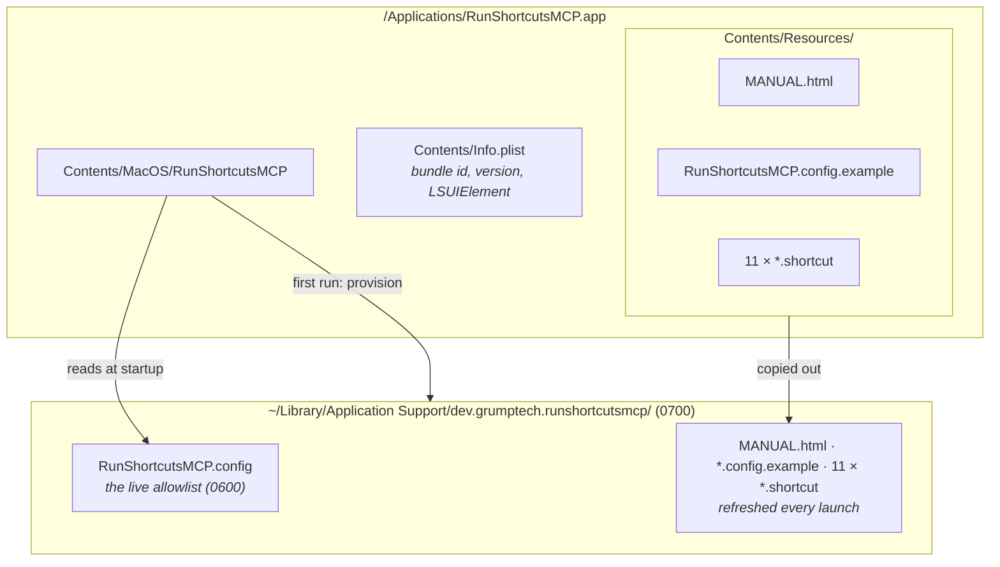

<!-- SPDX-License-Identifier: Apache-2.0 -->
# 1. Architecture

## 1.1 What this system is

RunShortcutsMCP is a **single-user, single-process, headless server** that gives
an MCP client controlled access to the macOS Shortcuts automation surface.

It has no UI, no network listener, no persistent database, and no daemon. It is
launched on demand by an MCP client as a child process, talks JSON-RPC 2.0 over
its own stdin/stdout, and is terminated by that client on disconnect. Everything
it knows lives in memory for the lifetime of that process, plus one JSON file on
disk (the allowlist).

Its entire job is to answer the question *"may I run this shortcut, and what did
it print?"* — safely, with bounded time, bounded output, and an audit trail.

## 1.2 System context

Two things this diagram is making a point of:

1. **The user configures the server directly**, out of band, by editing the
   allowlist. The assistant never writes that file. That edit *is* the consent
   decision (see [Security Model](05-security-model.md)).
2. **The audit trail flows back to the user**, not to the assistant. Events go to
   stderr, which the MCP client captures into its own log.

## 1.3 Process and lifecycle model

Key properties:

- **Fail closed at startup.** No allowlist, or an unreadable/invalid one, means
  the process exits rather than starting with an empty or guessed policy.
- **The allowlist is read exactly once**, at startup. Editing the config while
  the server runs has no effect until the client restarts it. This is deliberate:
  a policy that could change mid-session would make the audit log ambiguous.
- **`SIGPIPE` is ignored** so that writing to a closed pipe (a dead child, a
  disconnected client) surfaces as an error rather than killing the process.
- **`SIGTERM`/`SIGINT` are trapped** and drive a graceful shutdown that cancels
  tracked jobs. `SIGKILL` cannot be caught; a force-quit can still orphan a
  running shortcut.

## 1.4 Module structure

Five Swift targets, split along one hard line: **what ships** versus **what only
builds**.

| Target | Kind | Responsibility |
|--------|------|----------------|
| `RunShortcutsCore` | library | All policy and mechanism: allowlist model, path resolution, first-run provisioning, subprocess runner, background job store, wire payload types, audit events. **Zero third-party dependencies.** |
| `RunShortcutsMCP` | executable | `main.swift` only. Wires the core to the MCP SDK: declares the six tools, decodes arguments, enforces the gate, formats responses, handles signals. |
| `MarkdownHTML` | library | Renders `MANUAL.md` to a standalone HTML page. Build-time only. |
| `md2html` | executable | Thin CLI over `MarkdownHTML`, invoked by `scripts/build-app.sh`. |
| `RunShortcutsCoreTests` | test | Unit tests for the core (65 tests across 6 files). |
| `MarkdownHTMLTests` | test | Unit tests for the renderer (8 tests). |

### Why the core/executable split matters

`RunShortcutsCore` is deliberately free of MCP types. It knows nothing about
JSON-RPC, `Tool`, or `Value`. That is what makes it unit-testable without a
running client, and it is why the entire allowlist/limit/job-lifecycle surface
has real test coverage while the wire layer needs a separate protocol-level
smoke test (see [Build, Test & Release](07-build-test-release.md)).

The cost of that split is real and worth naming: **`main.swift` is top-level
executable code and cannot be imported by a test target.** Argument decoding and
response shapes are therefore structurally untestable by `swift test` — a gap
that has already produced one shipped bug (see §1.7).

## 1.5 Runtime component view

Note the direction of the `JobStore → ShortcutsRunner` edge: it is a **closure
injected at construction time in `main.swift`**, not a stored dependency. The job
store never constructs a runner and never reads the allowlist. That inversion is
what lets `JobStoreTests` drive the whole lifecycle with a canned closure and no
`shortcuts` binary present.

## 1.6 Concurrency model

Three distinct concurrency mechanisms, each chosen for a different reason:

| Mechanism | Where | Why this one |
|-----------|-------|--------------|
| **`actor`** | `JobStore` | Every caller is already `async`; an actor gives Swift 6-checked isolation with no `@unchecked` escape hatch. All mutable job state lives here. |
| **`struct` + `Sendable`** | `ShortcutsRunner`, `Allowlist` | Stateless value types. Free to copy across isolation domains; no synchronization needed. |
| **`NSLock` + `@unchecked Sendable`** | `OutputCollector`, `ProcessBox` | Forced by Foundation: `Process` and pipe drains run on Dispatch queues outside Swift concurrency, so these two types earn their `@unchecked` by guarding every field with one lock. |

The subprocess invocation itself (`ShortcutsRunner.invoke`) has exactly **one
suspension point** — a single `withCheckedThrowingContinuation` resumed after the
child exits *and* both output streams reach EOF. All the blocking work (writing
stdin, draining stdout, draining stderr, the SIGTERM/SIGKILL timers) happens on a
concurrent `DispatchQueue`, coordinated by a `DispatchGroup`. A long-running
shortcut therefore never occupies a cooperative thread.

> **Analogy for the Swift-side model:** `JobStore` is a serial queue that owns all
> the bookkeeping — like a `DispatchQueue`-confined class, except the compiler
> enforces it. `ShortcutsRunner` is the worker you hand a job to; it does its
> blocking I/O on a real concurrent queue and rings a bell (the continuation)
> exactly once when everything is finished.

## 1.7 Architectural decisions and their rationale

| Decision | Rationale | Consequence / cost |
|----------|-----------|--------------------|
| **Default-deny allowlist in a hand-edited file** | Consent granted once, in advance, by the human. A tool that prompted on every call would defeat its own purpose as an automation bridge. | The user must edit JSON. A typo means "not allowlisted", not a silent widening. |
| **`side_effect` defaults to `true` when absent** | Fail closed: an entry someone forgot to think about prompts rather than runs silently. | Most real entries end up explicitly `false`. |
| **`argv` array, never a shell string** | Eliminates shell metacharacter injection (CWE-78) outright. Shortcut names and input never touch a shell. | None worth noting. |
| **Names starting with `-` rejected at load** | A name like `--help` would be misparsed by `shortcuts` as an option (CWE-88). | Validated once at load; an invalid name refuses startup entirely. |
| **`run_shortcut_async` + polling, rather than a longer synchronous timeout** | MCP clients enforce their own request timeout (~60s in Claude Desktop) that no server-side setting can override. A background job is the only way to exceed it. | Two tools where one would be simpler, and a job store to maintain. |
| **The synchronous path also goes through the `JobStore`** | One queue, one concurrency cap, one watchdog, one place jobs are visible and cancellable. | A sync call can now time out *while still queued* — reported explicitly, and safe to retry because nothing ran. |
| **`ProcessInfo.systemUptime` for every duration** | Wall-clock `Date` can jump (NTP correction, manual change), which would expire fresh results or declare healthy jobs abandoned. | Two clocks to keep straight; `submittedAt` is for *display only*. |
| **Tombstones for retired jobs** | "Unknown job id" reads to an assistant as an invitation to re-run. "This ran and finished" does not. Critical for side-effecting shortcuts. | 256 tombstones retained; cheap, since they hold no output. |
| **Developer ID + notarization, not the Mac App Store** | The MAS mandates the App Sandbox, and a sandboxed app **cannot** execute `/usr/bin/shortcuts`. | Manual notarization step in the release process. |
| **Ship as a `.app` bundle, not a bare binary** | macOS TCC attributes automation permission to a stable, signed bundle identity. A bare binary would re-prompt or fail. | An extra packaging step; the config path derives from the bundle id. |
| **`VERSION` file stamped into `Info.plist`, read back at runtime** | One source of truth for the version, no hand-duplicated strings. | Running unbundled (`swift run`) reports `0.0.0+dev`. |
| **`swift-markdown` isolated in build-only targets** | Keeps the shipped binary's dependency graph to exactly one third-party package. | Two extra targets that never ship. |

### The bug that justifies the smoke test

During 1.2.0 development, `get_shortcut_result` silently ignored `wait_seconds`
whenever a client sent a bare integer (`20`) instead of a decimal (`20.0`). The
SDK's `Value.doubleValue` only matches its `.double` case and returns `nil` for
`.int`. Every real MCP client sends whole numbers as bare integers, so this
affected every caller — and all unit tests passed, because the decoding lives in
`main.swift` where no test target can reach it.

The fix is `numberValue(_:)` in `main.swift`, which accepts both representations.
The structural lesson is `scripts/smoke-test.py`: a protocol-level test that
drives the built binary over real JSON-RPC. **Any change to a tool's arguments or
response shape needs a case added there** — `swift test` cannot see that seam.

## 1.8 Deployment view

- `LSUIElement` is `true` — the process never shows in the Dock or app switcher.
- The only entitlement is `com.apple.security.automation.apple-events`, needed to
  drive Shortcuts. No sandbox, no network, no file-access entitlements.
- The bundle id `dev.grumptech.runshortcutsmcp` determines the Application
  Support folder name, and is read from `Bundle.main` at runtime so the folder
  always matches the signed identity.
- The seeded config is written with `O_CREAT|O_EXCL|O_NOFOLLOW` at mode `0600`
  and is **never overwritten** on later launches. The reference copies beside it
  *are* refreshed each launch, so app updates ship current examples.

## 1.9 Where to go next

- Types and their relationships → [Class Model](02-class-model.md)
- Request-by-request behaviour → [Sequence Diagrams](03-sequence-diagrams.md)
- Job states, slots, reaping → [Job Lifecycle & Concurrency](04-job-lifecycle.md)
