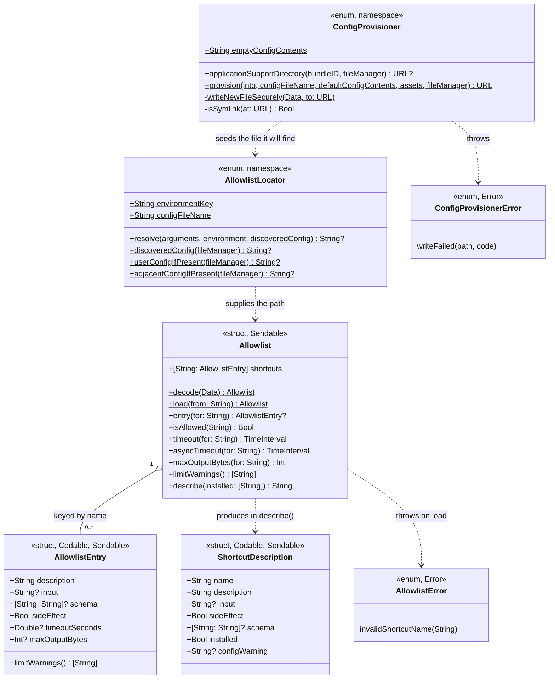
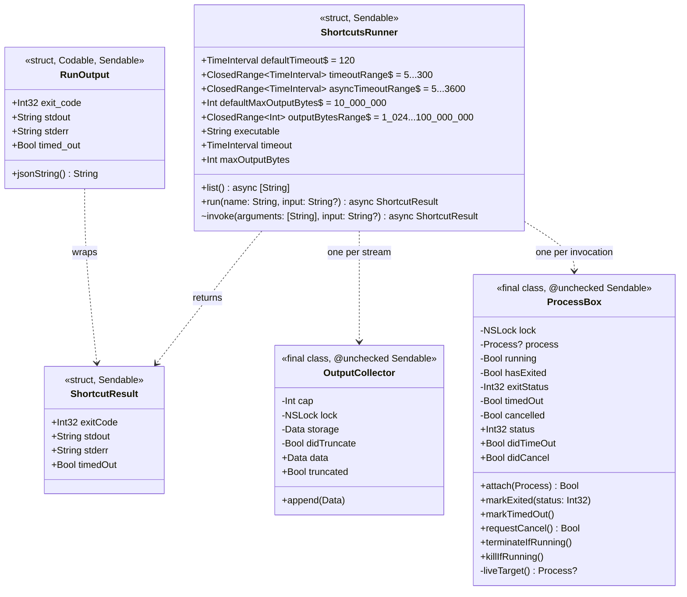
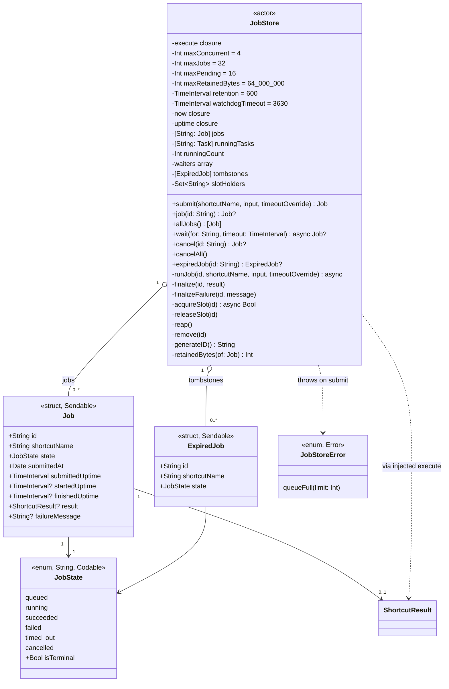
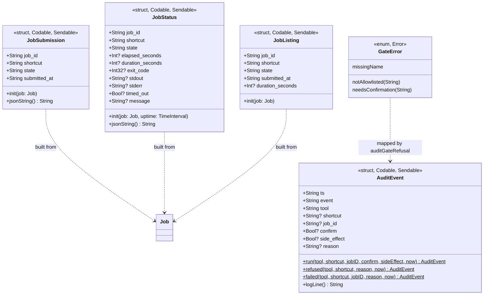
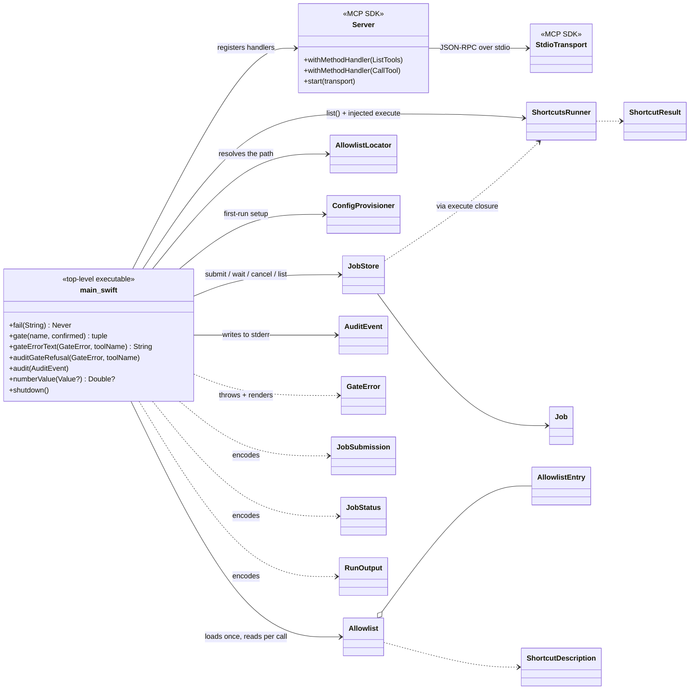
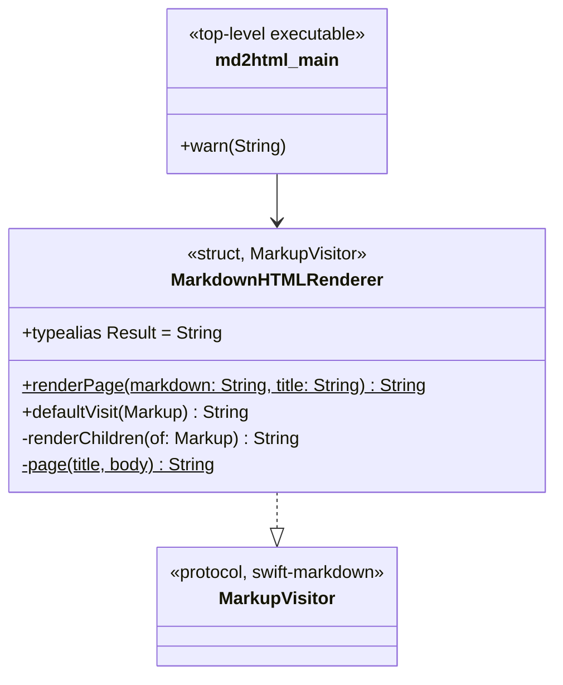

<!-- SPDX-License-Identifier: Apache-2.0 -->
# 2. Class Model

Every type in the system, what it owns, and how the types relate. Diagrams are
split by concern; §2.6 shows the whole graph at once.

## 2.1 Type inventory

| Type | Kind | Module | File | Responsibility |
|------|------|--------|------|----------------|
| `AllowlistEntry` | struct | Core | `Allowlist.swift` | One permitted shortcut and its metadata. |
| `Allowlist` | struct | Core | `Allowlist.swift` | The full permitted set; the authority every run consults. |
| `AllowlistError` | enum | Core | `Allowlist.swift` | Load-time validation failures. |
| `ShortcutDescription` | struct | Core | `Allowlist.swift` | Flattened, agent-facing view of an entry, plus live install status. |
| `AllowlistLocator` | enum (namespace) | Core | `AllowlistLocator.swift` | Decides *which file* the allowlist comes from. |
| `ConfigProvisioner` | enum (namespace) | Core | `ConfigProvisioner.swift` | First-run creation of the per-user config folder. |
| `ConfigProvisionerError` | enum | Core | `ConfigProvisioner.swift` | Provisioning write failures (carries `errno`). |
| `ShortcutsRunner` | struct | Core | `ShortcutsRunner.swift` | Injection-safe wrapper around `/usr/bin/shortcuts`. |
| `ShortcutResult` | struct | Core | `ShortcutsRunner.swift` | Captured exit code, stdout, stderr, timed-out flag. |
| `RunOutput` | struct | Core | `ShortcutsRunner.swift` | `ShortcutResult` in wire form (snake_case JSON). |
| `OutputCollector` | final class | Core | `ShortcutsRunner.swift` | Thread-safe, size-capped byte accumulator. `private`. |
| `ProcessBox` | final class | Core | `ShortcutsRunner.swift` | Thread-safe custody of one `Process`; the only place it is signalled. `private`. |
| `JobStore` | **actor** | Core | `JobStore.swift` | Registry + scheduler for background jobs. |
| `Job` | struct | Core | `JobStore.swift` | Snapshot of one job. |
| `JobState` | enum | Core | `JobStore.swift` | The six lifecycle states. |
| `JobStoreError` | enum | Core | `JobStore.swift` | Submission refusals (`queueFull`). |
| `ExpiredJob` | struct | Core | `JobStore.swift` | Tombstone: a retired job's outcome, without its output. |
| `JobSubmission` | struct | Core | `JobPayload.swift` | Wire payload for `run_shortcut_async`. |
| `JobStatus` | struct | Core | `JobPayload.swift` | Wire payload for `get_shortcut_result` / `cancel_shortcut_job`. |
| `JobListing` | struct | Core | `JobPayload.swift` | One row of `list_shortcut_jobs`. |
| `AuditEvent` | struct | Core | `AuditEvent.swift` | One security-relevant event, as a line of JSON. |
| `GateError` | enum | Executable | `main.swift` | Why a run was refused before anything executed. |
| `MarkdownHTMLRenderer` | struct | MarkdownHTML | `MarkdownHTMLRenderer.swift` | `MarkupVisitor` that emits an HTML page. Build-time only. |

## 2.2 Policy layer — allowlist and configuration

**Design notes**

- `Allowlist` is immutable and `Sendable`. It is loaded once and read from every
  isolation domain without synchronization.
- `AllowlistEntry.sideEffect` has a **custom `init(from:)`** that defaults it to
  `true` when the JSON key is absent. This is the one place fail-closed behaviour
  is encoded in a decoder.
- `ShortcutDescription` exists so the `list_shortcuts` payload can carry two
  things the entry itself does not know: whether the shortcut is *installed*
  right now, and whether its configured limits were out of range.
- `AllowlistLocator.resolve` takes `discoveredConfig` as an **injected closure**
  so the precedence logic is testable with no filesystem at all.

## 2.3 Execution layer — the subprocess runner

**Design notes**

- `ShortcutsRunner` carries **no state between calls**. The per-run limits are
  properties of the value, so `main.swift` builds a fresh, correctly-limited
  runner for every job rather than mutating a shared one.
- **The class-level constants are the policy bounds**, not the runner's own
  behaviour: `invoke` does not clamp anything. Clamping happens in `Allowlist`
  (`timeout(for:)`, `asyncTimeout(for:)`, `maxOutputBytes(for:)`), which keeps
  mechanism and policy separate.
- `OutputCollector` and `ProcessBox` are the system's only two `@unchecked
  Sendable` types, and both earn it the same way: one `NSLock`, every field
  guarded, no field readable outside it.
- `ProcessBox.liveTarget()` is the single guard behind every signal sent. Without
  it, a timeout work item scheduled at launch could fire after the child exited
  and its PID was recycled — `killIfRunning` signals a raw PID, so it could reach
  an unrelated process. The check narrows that window to the interval between the
  check and the `kill(2)`.

## 2.4 Job layer — the background store

**Design notes**

- The `execute` closure is the **seam that keeps the store testable**. Its
  signature is `(name, input, timeoutOverride) async throws -> ShortcutResult`;
  `main.swift` is the only place that binds it to a real `ShortcutsRunner`.
- `Job` is a **value**. Every query returns an independent copy — mutating a
  returned `Job` cannot affect the store's record.
- **Two clocks are tracked deliberately and are not interchangeable.**
  `submittedAt` (wall clock) exists only to be *reported* as `submitted_at`. Every
  elapsed-time decision — the watchdog, retention, `wait(for:timeout:)` — reads
  the monotonic `uptime` closure. A clock jump must never expire a fresh result
  or declare a healthy job abandoned.
- `slotHolders` tracks concurrency slots **by job id** rather than as a bare
  counter. That is what makes `releaseSlot(id:)` idempotent, which is what lets
  the watchdog reclaim an abandoned job's slot without risking a double release
  when that job's task eventually returns.

## 2.5 Wire layer — payloads and audit

**Design notes**

- **Optionality is meaningful, not incidental.** `JobStatus`'s optional fields
  are omitted from the JSON entirely when `nil` (Swift's synthesized `Encodable`
  uses `encodeIfPresent`), so an absent `stdout` can never be mistaken for an
  empty one. `elapsed_seconds` appears only while non-terminal;
  `duration_seconds` only once terminal.
- A **cancelled** job reports `stdout`/`stderr` but deliberately omits
  `exit_code` and `timed_out` — a signal-derived exit code means nothing to a
  client, while partial output from a side-effecting shortcut is exactly what the
  caller needs to see.
- `JobListing` **never** carries `stdout`/`stderr`. The tool exists to recover a
  lost `job_id`, not to re-deliver megabytes of output.
- `AuditEvent` **never records shortcut input.** Input can carry personal
  content; the value of the trail is in what was invoked, not what was passed.
- `logLine()` emits compact, key-sorted JSON with one trailing newline, so the
  log stays greppable and diffable.

## 2.6 Whole-system relationships

## 2.7 The build-time renderer

Structurally separate from everything above; it exists only to turn
`assets/MANUAL.md` into `MANUAL.html` during `scripts/build-app.sh`.

Covers the constructs the manual actually uses: headings, paragraphs,
emphasis/strong, inline and fenced code, ordered/unordered lists, block quotes,
thematic breaks, links, soft/hard breaks, and GFM tables. Anything unhandled
falls through `defaultVisit` and degrades to its children's text. Output is a
single self-contained page with embedded CSS and no external assets.
