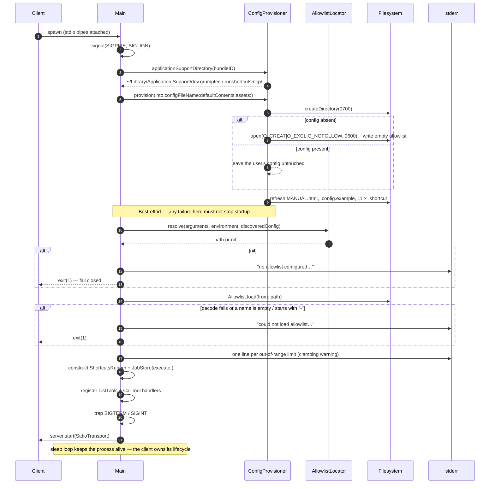
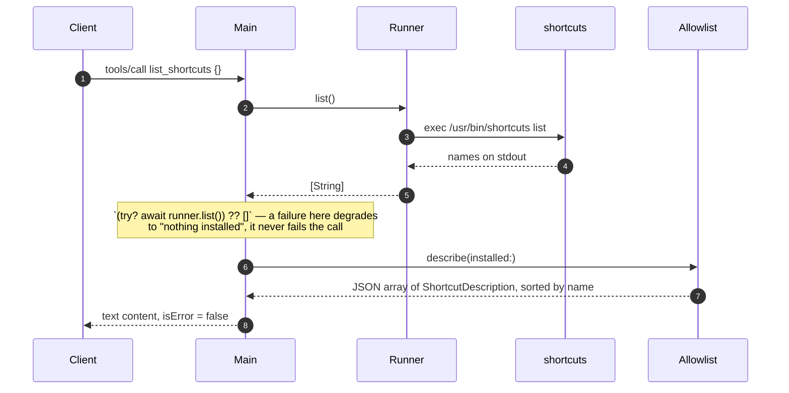
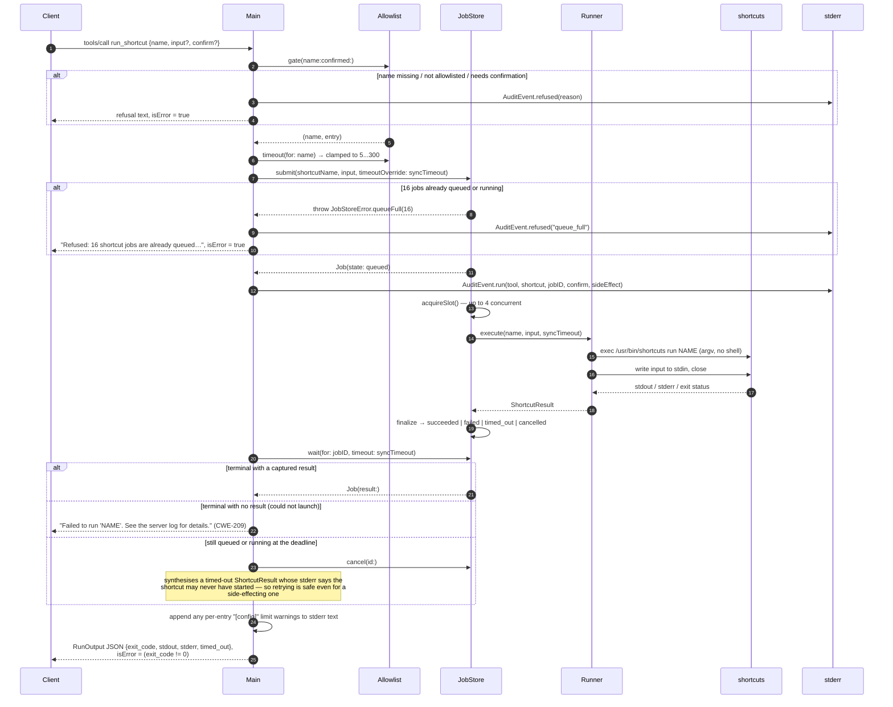
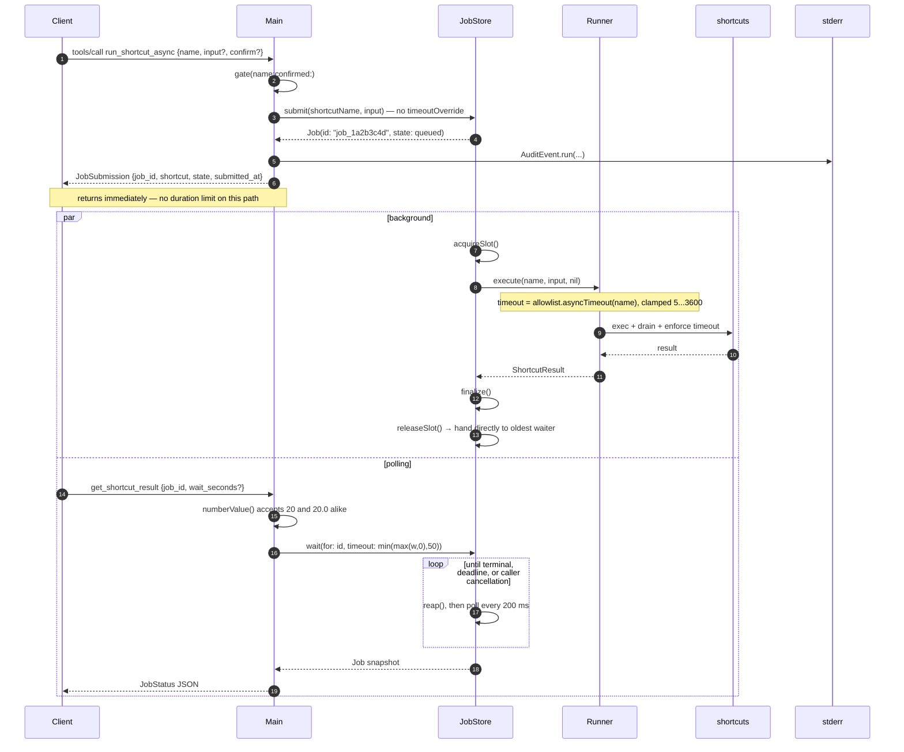
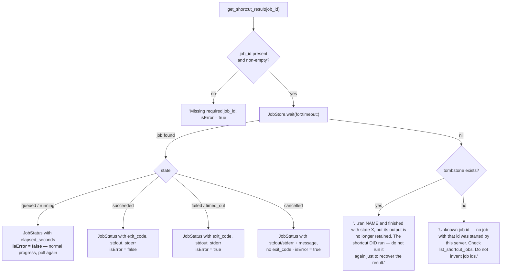
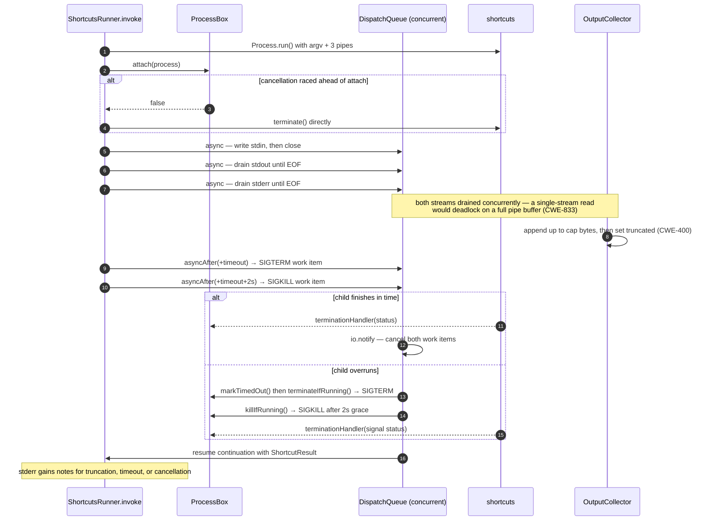
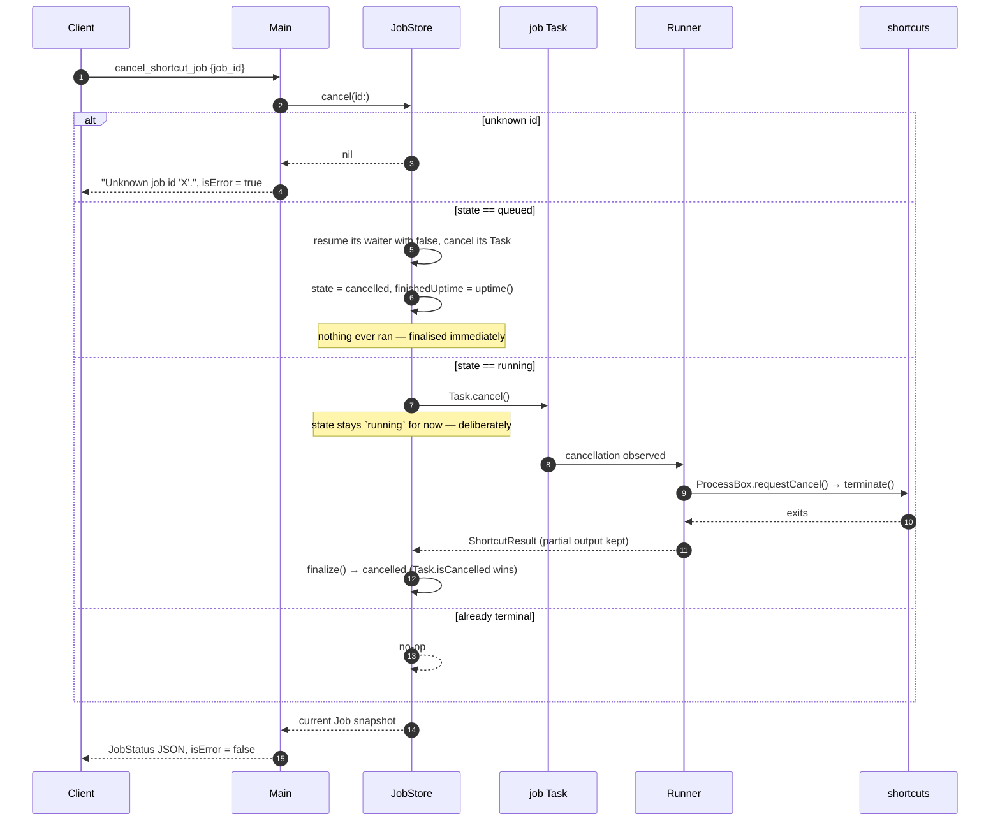
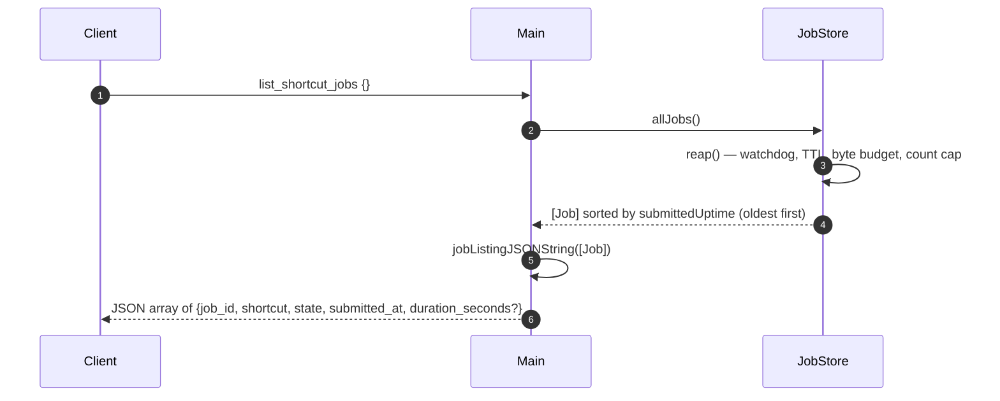
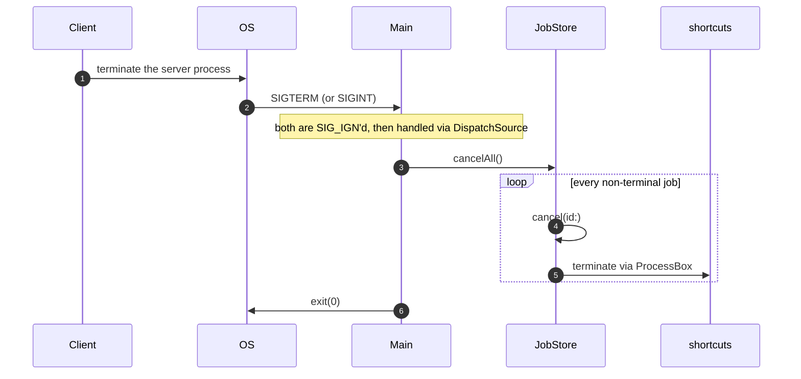
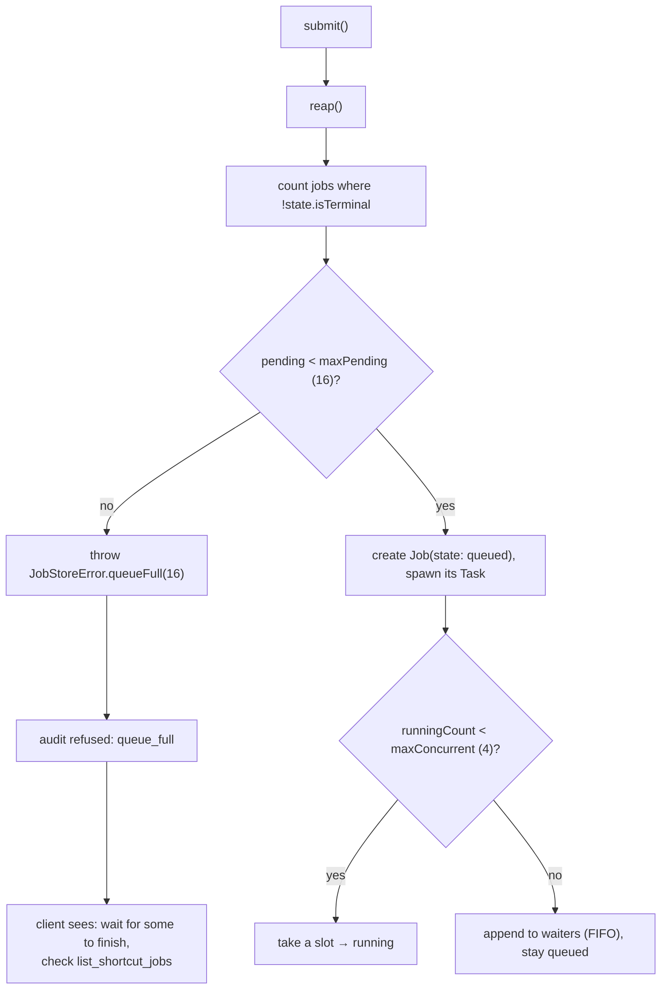

<!-- SPDX-License-Identifier: Apache-2.0 -->
# 3. Sequence Diagrams

Every externally-visible flow, traced end to end. Participants are consistent
across diagrams:

| Participant | What it is |
|-------------|------------|
| `Client` | The MCP client process (Claude Desktop / Claude Code) |
| `Main` | `Sources/RunShortcutsMCP/main.swift` — handlers, gate, audit |
| `Allowlist` | The immutable policy loaded at startup |
| `Store` | `JobStore` actor |
| `Runner` | `ShortcutsRunner` (a fresh, limit-configured value per job) |
| `shortcuts` | The `/usr/bin/shortcuts` child process |
| `stderr` | The audit/server log the client captures |

## 3.1 Startup

## 3.2 `list_shortcuts`

The only tool that touches the machine without running anything the user
allowlisted — `shortcuts list` is invoked purely to compute the `installed` flag.

Each element carries `name`, `description`, `input`, `schema`, `side_effect`,
`installed`, and `config_warning` when a configured limit was out of range.

## 3.3 `run_shortcut` — the synchronous path

Since 1.2.0 this path **also goes through the job store**, so it shares the
concurrency cap, the backlog limit, the watchdog, cancellation, and visibility in
`list_shortcut_jobs`. The response payload is unchanged from the direct-execution
version it replaced.

### The queued-timeout case, stated plainly

If four shortcuts are already running, a fifth `run_shortcut` waits its turn. If
its own timeout elapses while it is *still queued*, the client gets a
timeout-shaped result for a shortcut that **never executed**. The stderr note
says so explicitly, because the correct action differs from a real timeout:
retrying is safe, including for a shortcut that changes something.

## 3.4 `run_shortcut_async` + `get_shortcut_result` — the recommended path

### What `get_shortcut_result` returns, by case

The tombstone branch is a security control, not a nicety. Telling an assistant
"unknown id" for a job that already ran reads as an invitation to run the
shortcut a second time — which, for a side-effecting shortcut that already
succeeded, means doing it twice.

## 3.5 Timeout and truncation inside one invocation

Every signal goes through `ProcessBox.liveTarget()`, which requires both the
box's own bookkeeping and Foundation's `process.isRunning` to agree the child is
alive. Both work items are cancelled the moment the child actually exits, so a
slow-firing timer can never reach a recycled PID.

## 3.6 `cancel_shortcut_job`

**Why a running job is not marked cancelled immediately:** the state should
reflect the child process's real exit, not a projection of intent. Until
`invoke` returns, the shortcut may well still be doing work.

**What cancellation does *not* do:** it does not undo anything, and it does not
reliably stop the shortcut. A shortcut already under way is executed by the
Shortcuts app, not by this server, and will usually run to completion and apply
its changes. The tool description says this in as many words. Treat it as *stop
waiting for the result*.

## 3.7 `list_shortcut_jobs`

Never includes `stdout`/`stderr`. Its purpose is recovering a lost `job_id`.

## 3.8 Graceful shutdown

Without this, a disconnecting client would leave in-flight shortcut subprocesses
running, reparented to `launchd` — a real consent problem for a side-effecting
shortcut. `SIGKILL` cannot be caught, so a force-quit can still orphan a child.

## 3.9 Backpressure: the queue-full path

Two separate limits doing two separate jobs: `maxConcurrent` (4) throttles how
much runs at once; `maxPending` (16) bounds the **backlog**, so no burst of
requests can enqueue an unbounded number of side-effecting runs that keep firing
four at a time long after anyone is watching.
