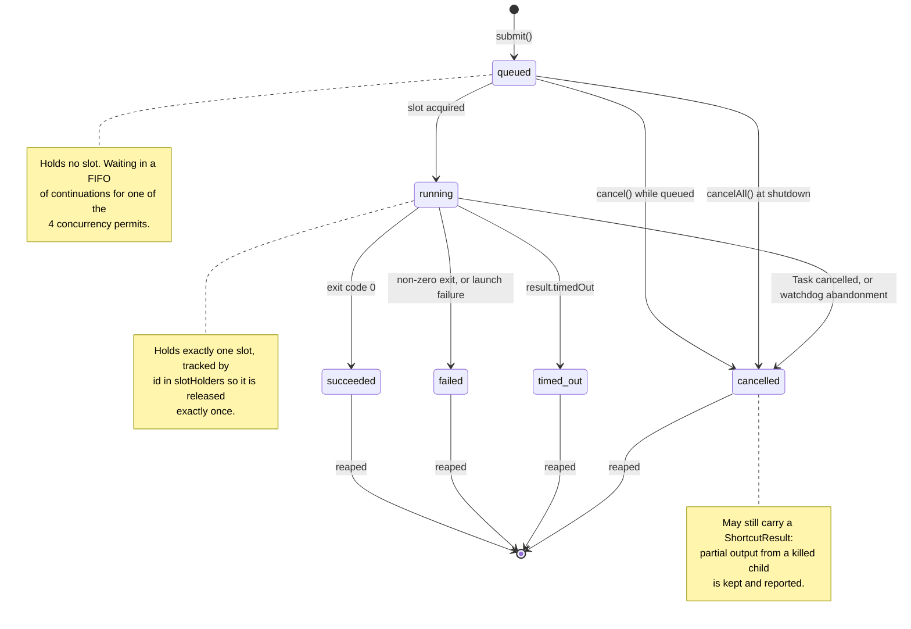
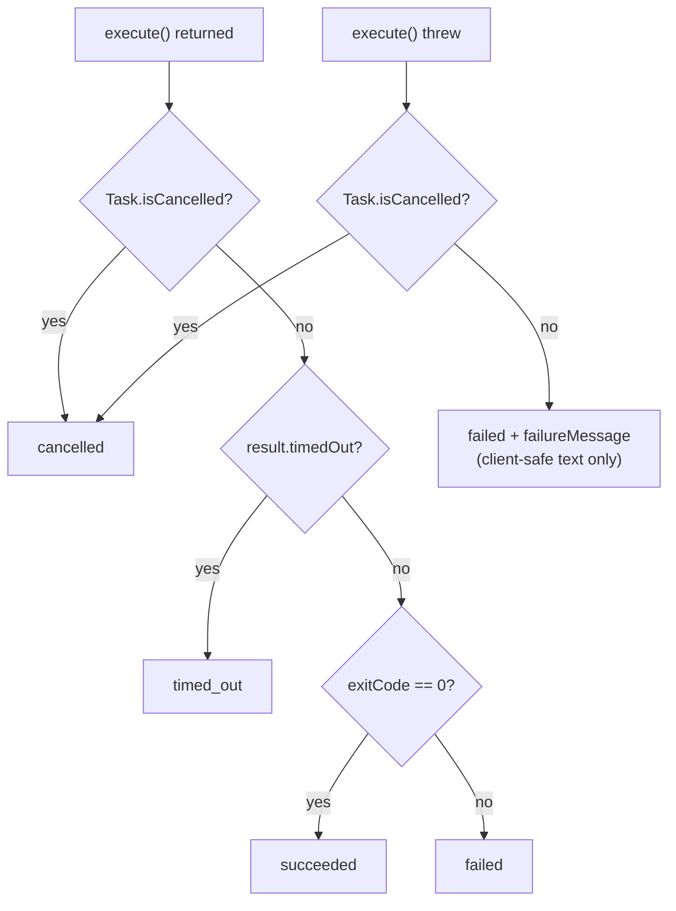
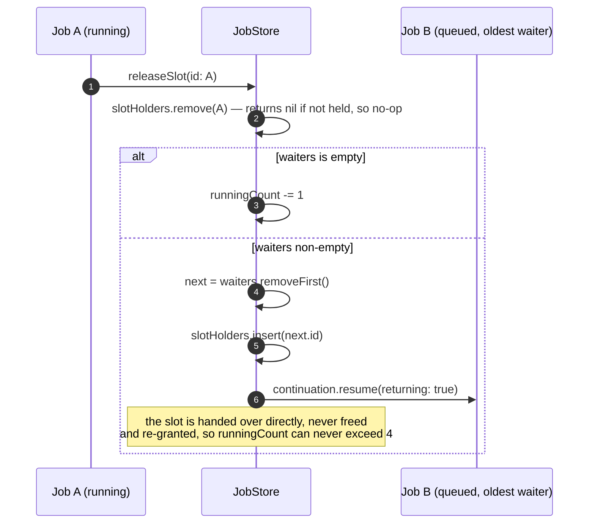
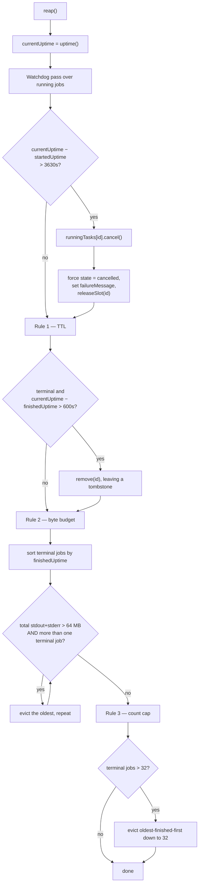
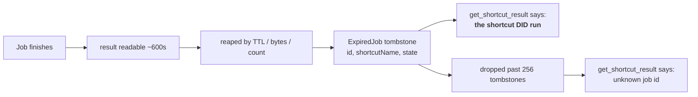

<!-- SPDX-License-Identifier: Apache-2.0 -->
# 4. Job Lifecycle & Concurrency

`JobStore` is the most intricate part of the system. This document covers its
state machine, its two independent limits, the retention rules, the watchdog, and
the clock discipline that keeps all of it correct.

Source: `Sources/RunShortcutsCore/JobStore.swift`.

## 4.1 States

Six states; two in-flight, four terminal. `JobState.isTerminal` is the single
predicate the rest of the system branches on.



**Terminal is final.** `finalize` and `finalizeFailure` both begin with
`guard …, !current.state.isTerminal else { return }`, so a late result arriving
from a task the watchdog already abandoned cannot resurrect or rewrite the job.

### How the terminal state is chosen



Cancellation is checked **first**. A cancelled job's child is killed, which
yields a signal-derived exit code that would otherwise be misreported as
`failed`.

## 4.2 The two limits, and why they are two

| Limit | Default | Bounds | What it prevents |
|-------|---------|--------|------------------|
| `maxConcurrent` | 4 | How many jobs may be `running` at once | Four simultaneous `shortcuts` subprocesses is already plenty of load on the Shortcuts app; more is thrash. |
| `maxPending` | 16 | How many jobs may be `queued` **or** `running` at once | A burst of submissions enqueuing an unbounded backlog of side-effecting runs that keep firing four at a time long after anyone is watching. |

Throttling execution alone does not bound the backlog. Without `maxPending`, a
caller could submit a thousand jobs, get a thousand `job_id`s back, and the store
would dutifully work through all of them.

## 4.3 The slot handoff



Two properties worth stating explicitly:

- **FIFO.** `waiters` is an array, not a dictionary, so slots go out in
  submission order.
- **Idempotent release.** `releaseSlot` returns immediately if the id is not in
  `slotHolders`. That is precisely what lets the watchdog forcibly reclaim an
  abandoned job's slot without risking a double release if that job's own task
  eventually returns and calls `releaseSlot` too.

## 4.4 Reaping — the housekeeping pass

`reap()` runs at the top of **every public accessor** (`submit`, `job`,
`allJobs`, `wait`, `cancel`). There is no background timer: housekeeping is
driven entirely by client activity, which makes it fully deterministic under
injected clocks and therefore testable without waiting out real minutes.



**Invariants the rules preserve**

- A `queued` or `running` job is **never evicted**. The watchdog transitions a
  stuck job to `cancelled` instead of deleting its record.
- **The newest terminal job always survives Rule 2** (`terminal.count > 1` in
  the loop condition). A single job may legitimately hold more output than the
  entire budget — the per-stream cap can be 100 MB while the budget is 64 MB —
  and evicting it on the very next reap would retire a result before its caller
  ever read it.
- Every eviction goes through `remove(id:)`, which leaves a **tombstone** for any
  job that reached a terminal state.

## 4.5 Tombstones



A tombstone holds no captured output, so 256 of them are far cheaper than 256
results. The distinction they buy is the point: *"this ran and finished, I no
longer have the output"* versus *"I have never heard of this id."* Conflating the
two invites re-running a side-effecting shortcut that already succeeded.

## 4.6 The watchdog

**What it is for:** a job whose child ignores termination — one stuck in an
uninterruptible sleep that never closes its pipes — never returns from
`execute`, so `runJob` would never release its slot. Enough of those permanently
exhaust `maxConcurrent` and stall every future job.

**Why the threshold is a single constant (3630s = 3600 + 30) rather than each
job's own timeout:** `ShortcutsRunner.invoke` already enforces the per-job
timeout itself. The watchdog only ever fires for a job that has outlived even the
widest legitimate async timeout, which means it is genuinely stuck.

**The two-step response, in order:**

1. `runningTasks[id]?.cancel()` — signal first, so a job that is merely slow
   unwinds cooperatively and terminates its own child.
2. Force the record terminal and `releaseSlot(id:)` **without waiting to see
   whether the signal took**. This stays correct because `releaseSlot` is
   idempotent and both finalizers ignore already-terminal jobs.

## 4.7 Clock discipline

This is the subtlest correctness property in the codebase, so it is worth being
explicit.

| Field | Clock | Used for |
|-------|-------|----------|
| `submittedAt` | `Date` (wall clock) | **Display only** — the `submitted_at` field on the wire. |
| `submittedUptime` | `ProcessInfo.systemUptime` (monotonic) | Ordering, and elapsed time for a job still queued. |
| `startedUptime` | monotonic | Watchdog age, `duration_seconds`, `elapsed_seconds`. |
| `finishedUptime` | monotonic | Retention TTL, `duration_seconds`. |

**Rule: nothing that measures a duration may read `submittedAt`.**

What goes wrong if that rule is broken — each of these has a regression test:

| Event | Bug it would cause | Test |
|-------|--------------------|------|
| Wall clock jumps **forward** (NTP correction) | Healthy running jobs declared abandoned by the watchdog | `testForwardWallClockStepDoesNotTripWatchdog` |
| Wall clock jumps **forward** | Every retained result expires at once | `testForwardWallClockStepDoesNotExpireResults` |
| Wall clock jumps **backward** | A bounded wait stretches past the MCP client's request ceiling | `testBackwardWallClockStepDoesNotExtendWait` |

`systemUptime` also does not advance while the system is asleep — the same
property as the `DispatchTime` deadline `ShortcutsRunner` enforces its own
timeout with. The two layers therefore agree on how long a job has actually been
running, rather than disagreeing across a lid-close.

> **Analogy:** `submittedAt` is the wall clock in the room — right for telling
> someone *when* something happened, useless for timing a race because someone
> may reset it mid-race. The uptime readings are a stopwatch: they only ever
> count forward, at one rate, from a fixed point.

## 4.8 `wait(for:timeout:)`

Implemented as a **bounded poll** at 200 ms, not as a continuation the caller
could stack:

```swift
let deadline = uptime() + timeout
while true {
    reap()
    guard let current = jobs[id] else { return nil }
    if current.state.isTerminal || uptime() >= deadline || Task.isCancelled { return current }
    try? await Task.sleep(for: .milliseconds(200))
}
```

Three deliberate properties:

- **Duplicate and concurrent waits for the same id are always safe.** Nothing is
  registered; each waiter polls independently.
- **`Task.isCancelled` is load-bearing, not defensive.** A cancelled
  `Task.sleep` *throws* rather than suspending. Without the check, the loop would
  spin without ever yielding — and because the method is actor-isolated, that
  spin would hold the actor and starve every other job operation until the
  deadline. Covered by `testCancelledWaitDoesNotStarveTheActor`.
- **Returning a non-terminal job is a normal outcome**, not an error. It is the
  handoff back to the caller that makes polling work.

## 4.9 Tunables, all in one place

| Parameter | Default | Where set |
|-----------|---------|-----------|
| `maxConcurrent` | 4 | `JobStore.init` |
| `maxPending` | 16 | `JobStore.init` |
| `maxJobs` (terminal records retained) | 32 | `JobStore.init` |
| `maxRetainedBytes` | 64 MB | `JobStore.init` |
| `retention` (result TTL) | 600 s | `JobStore.init` |
| `watchdogTimeout` | 3630 s | `asyncTimeoutRange.upperBound + 30` |
| `maxTombstones` | 256 | `JobStore` stored property |
| poll interval in `wait` | 200 ms | `JobStore.wait` |
| `get_shortcut_result` wait | 45 s default, 50 s max | `main.swift` |

All are constructor parameters except `maxTombstones` and the poll interval.
None are user-configurable — the allowlist deliberately controls per-shortcut
limits only, not store-wide scheduling policy.
