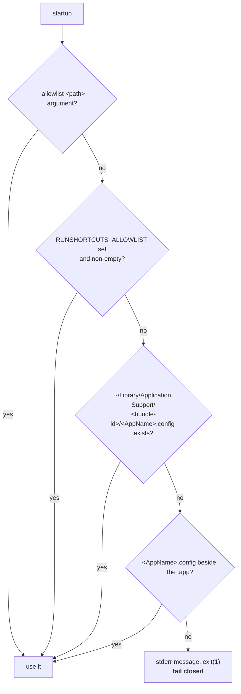
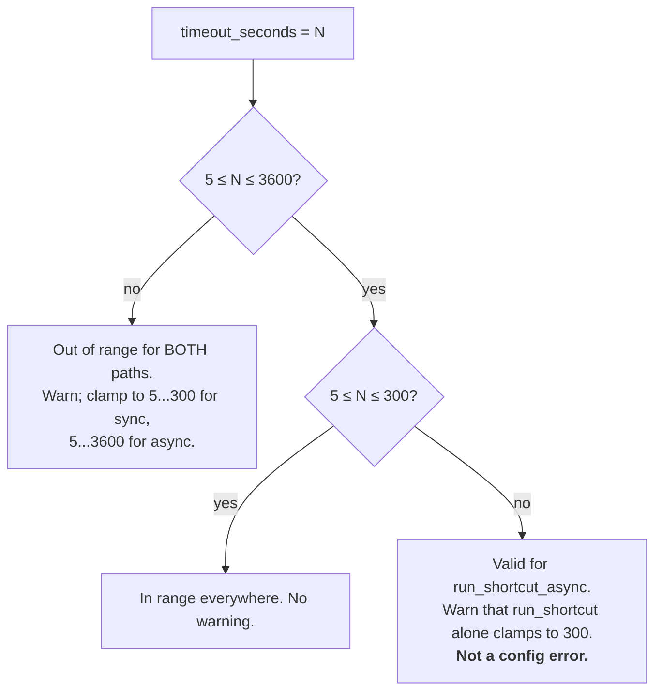
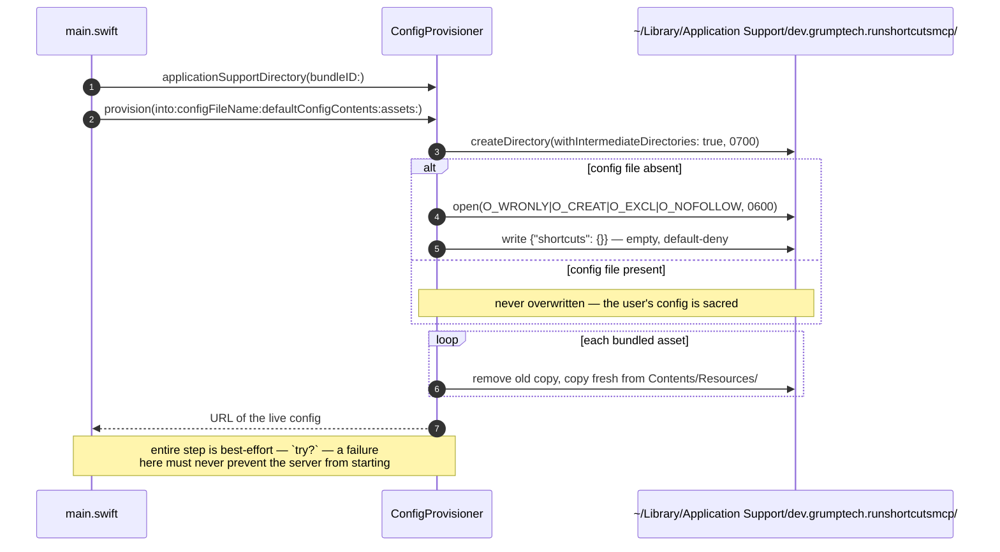

<!-- SPDX-License-Identifier: Apache-2.0 -->
# 6. Configuration Reference

Everything about the allowlist file: where it comes from, what it may contain,
how its values are validated and clamped, and how it gets there on first run.

The end-user walkthrough is `../assets/MANUAL.md` §3. This document is the
maintainer-facing reference.

## 6.1 Path resolution



Implemented by `AllowlistLocator.resolve(arguments:environment:discoveredConfig:)`,
with the last two steps behind the injected `discoveredConfig` closure so the
precedence logic is unit-testable with no filesystem.

| Rank | Source | Typical use |
|------|--------|-------------|
| 1 | `--allowlist <path>` | Testing; multiple profiles; an allowlist stored outside the standard location. |
| 2 | `RUNSHORTCUTS_ALLOWLIST` | CI, or an MCP client config that sets env rather than args. |
| 3 | `~/Library/Application Support/<bundle-id>/<AppName>.config` | **The recommended default.** Created automatically on first run. |
| 4 | `<AppName>.config` beside the `.app` | Single-user convenience fallback. |

Two derived names, both computed at runtime rather than hardcoded:

- `configFileName` = `"\(ProcessInfo.processInfo.processName).config"` — normally
  `RunShortcutsMCP.config`.
- The Application Support folder = `Bundle.main.bundleIdentifier`, falling back
  to the process name when unbundled. Reading it from the bundle means the folder
  always matches the **signed identity**, which is what TCC keys automation
  permission on.

**There is no working-directory fallback, by design.** A server launched by a
client inherits whatever cwd that client happened to have; trusting it would make
the effective policy unpredictable.

## 6.2 File format

```jsonc
{
  "shortcuts": {
    "<exact shortcut name>": {
      "description": "…",           // required
      "input": "json",              // optional
      "schema": { "field": "…" },   // optional
      "side_effect": true,          // optional, DEFAULTS TO true
      "timeout_seconds": 300,       // optional
      "max_output_bytes": 10000000  // optional
    }
  }
}
```

| Key | Type | Required | Default | Meaning |
|-----|------|----------|---------|---------|
| `description` | string | **yes** | — | What the shortcut does. Surfaced verbatim to the assistant by `list_shortcuts`; this is how it decides when to reach for the shortcut. |
| `input` | string | no | `nil` | Free-form hint about the input shape — `"json"`, `"text"`, `"none"`. Not validated or enforced. |
| `schema` | object&lt;string,string&gt; | no | `nil` | Field-name → description map documenting a structured (JSON) input. Documentation only; the server does not validate input against it. |
| `side_effect` | bool | no | **`true`** | Whether running it changes state. `true` requires `confirm: true` on both run tools. |
| `timeout_seconds` | number | no | 120 | Wall-clock limit for one run. Clamped — see §6.3. |
| `max_output_bytes` | int | no | 10 000 000 | Per-stream capture cap. Clamped — see §6.3. |

**Validation performed at load:**

1. The document must decode as `{ "shortcuts": { … } }`. Anything else throws a
   `DecodingError` and the server exits.
2. `description` must be present on every entry.
3. **No key may be empty or begin with `-`** — `AllowlistError.invalidShortcutName`,
   which the `shortcuts` CLI would otherwise misparse as an option (CWE-88).

Note what is *not* validated: whether the shortcut exists. An allowlisted but
uninstalled shortcut is reported by `list_shortcuts` as `"installed": false` and
fails at run time with the CLI's own error. That separation is intentional — the
allowlist is a statement of *permission*, not of *presence*.

## 6.3 Limits and clamping

Clamping lives in the **policy** layer (`Allowlist`), never in the mechanism
layer (`ShortcutsRunner` accepts whatever it is handed).

| Limit | Default | Allowed range | Applied by |
|-------|---------|---------------|------------|
| Timeout, `run_shortcut` | 120 s | **5 – 300 s** | `Allowlist.timeout(for:)` |
| Timeout, `run_shortcut_async` | 120 s | **5 – 3600 s** | `Allowlist.asyncTimeout(for:)` |
| Output cap, per stream | 10 MB | **1 KB – 100 MB** | `Allowlist.maxOutputBytes(for:)` |

The two timeout ranges differ because a synchronous call has to finish inside the
MCP client's own request timeout (~60 s in Claude Desktop, which no server-side
setting can change), while a background job does not.



That middle case is worth understanding: `"timeout_seconds": 900` is a
**perfectly valid** configuration for a shortcut you intend to run
asynchronously. The warning exists to say the synchronous tool cannot honour it,
not to say the value is wrong.

**Where warnings surface — three places, all non-fatal:**

1. On stderr at startup, once per out-of-range value, prefixed with the shortcut
   name (`Allowlist.limitWarnings()`).
2. In each `list_shortcuts` entry, as `config_warning`.
3. Appended to a synchronous run's `stderr` as `[config] …`, so the caller sees
   it at the moment it matters.

## 6.4 First-run provisioning



**Assets refreshed on every launch** (12 files): `MANUAL.html`,
`RunShortcutsMCP.config.example`, and ten callable `.shortcut` files plus
`GetSubTask`.

`GetSubTask` is deliberately **absent from the example allowlist**: it is a
private subroutine that `TagReminder` and `GetReminderTags` call internally. It
must be installed for those two to work, but it is never invoked directly, so
allowlisting it would widen the surface for no benefit.

## 6.5 The bundled example shortcuts

Shipped as a working starting point; the user installs the ones they want and
allowlists them. Grouped by what they work on:

| Shortcut | `side_effect` | Purpose |
|----------|:-------------:|---------|
| **Apple Notes** | | |
| `TagNote` | `true` | Add or remove a live tag on a note, so it enters or leaves tag-driven Smart Folders. |
| `GetNoteContents` | `false` | A note's true current content as Markdown, **including live tags** — a plain read can miss tags just added. |
| `MoveNote` | `true` | Move a note between folders, via a placeholder note in the destination. |
| **Apple Reminders** | | |
| `TagReminder` | `true` | Add or remove a live tag on a reminder (root or subtask). EventKit has no tags API for reminders. |
| `GetReminderTags` | `false` | Read a reminder's tags. Root reminders only. |
| `GetReminderLayout` | `false` | One-call dump of the whole parent/subtask tree. |
| `GetReminderLineage` | `false` | Parent and children for one known root reminder. |
| `IsSubTask` | `false` | Fast root-vs-child check for one title. |
| `SetReminderLineage` | `true` | Nest a reminder under a parent, or clear its parent. The only writing member of the hierarchy set. |
| `GetSubTask` | *(not allowlisted)* | Private subroutine of `TagReminder` / `GetReminderTags`. |
| **Housekeeping** | | |
| `ShortcutBackup` | `false` | Archive Shortcuts folders to a dated `.tar.gz`. Writes only to the given destination; never modifies Shortcuts. |

These exist because Apple's own frameworks have real gaps — EventKit exposes
neither tags nor parent/child structure for reminders, and the Notes connector
cannot create a live tag at all. The shortcuts are the working path around those
gaps.

Note the `side_effect` judgement calls: `ShortcutBackup` **writes files** yet is
marked `false`, because it only ever writes to a destination the caller names and
never mutates the thing being backed up. `side_effect` means *changes state the
user cares about*, not *touches the disk*.

## 6.6 Registering with an MCP client

Point the client at the **bundled** executable so TCC attributes automation
permission to the signed bundle identity — never at a bare `.build/` binary.

```json
{
  "mcpServers": {
    "run-shortcuts": {
      "command": "/Applications/RunShortcutsMCP.app/Contents/MacOS/RunShortcutsMCP"
    }
  }
}
```

With the config in the standard Application Support location, no `args` are
needed. To use an allowlist elsewhere:

```json
"args": ["--allowlist", "/full/path/to/RunShortcutsMCP.config"]
```

**Smoke check:** ask the client to call `list_shortcuts`. If it returns your
entries with `installed` flags, the bundle identity, the TCC grant, and the
process-spawn path all work.
