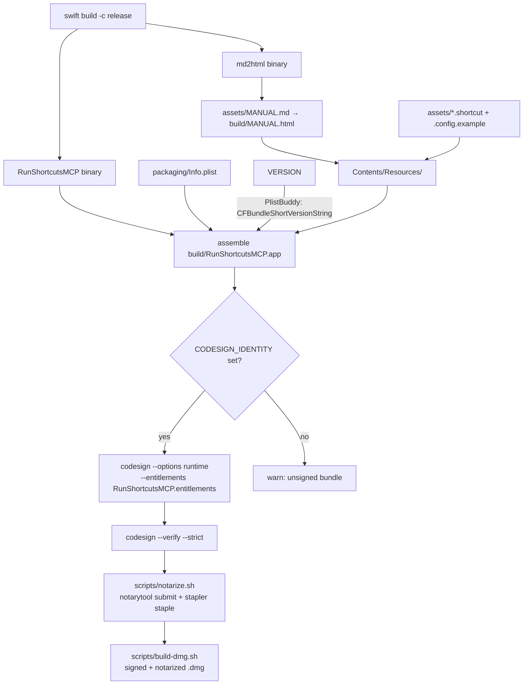
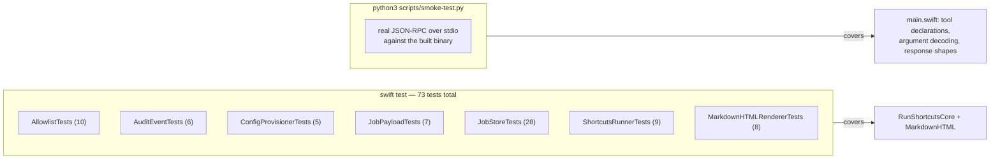

<!-- SPDX-License-Identifier: Apache-2.0 -->
# 7. Build, Test & Release

## 7.1 The build pipeline



| Script | Produces | Notes |
|--------|----------|-------|
| `scripts/build-app.sh [debug\|release]` | `build/RunShortcutsMCP.app` | Builds, renders the manual, assembles the bundle, stamps the version, copies assets, signs if `CODESIGN_IDENTITY` is exported. Also drops loose copies of the manual/example/shortcuts into `build/`. |
| `scripts/notarize.sh` | a stapled `.app` | App Store Connect **API key** auth — no Apple ID, no app-specific password. |
| `scripts/build-dmg.sh` | `build/RunShortcutsMCP.dmg` | Drag-to-Applications layout; manual, example config and shortcuts in a `Resources/` folder. Same Developer ID cert as the app; notarized and stapled. |
| `scripts/smoke-test.py` | pass/fail | Protocol-level test against the built binary. See §7.3. |

### Versioning

`VERSION` at the repo root is the single source of truth. `build-app.sh` stamps
it into `Info.plist` as `CFBundleShortVersionString`; the server reads it back
from `Bundle.main` at runtime and reports it in the MCP `initialize` result.
Running unbundled (`swift run`) reports `0.0.0+dev`.

Never hand-duplicate the version anywhere else. To cut a release: bump `VERSION`,
add a `CHANGELOG.md` entry, update `SECURITY.md`'s supported-version line.

### Why Developer ID and not the Mac App Store

Not a preference — a hard constraint. The MAS mandates the App Sandbox, and a
sandboxed app **cannot execute `/usr/bin/shortcuts`**: sandboxed apps may only
launch helper tools embedded in their own bundle with an inherited sandbox, which
cannot reach the system binary. The architecture also runs as a headless stdio
server launched as a child process, which is not how MAS apps run at all.

## 7.2 Test strategy



| Suite | What it pins down |
|-------|-------------------|
| `AllowlistTests` | Decoding, the `side_effect`-defaults-`true` rule, default-deny, `installed` marking, locator precedence, hyphen-name rejection, limit clamping, the async-range-wider-than-sync relationship, warning text. |
| `AuditEventTests` | That the gate decision is recorded, that refusals carry a machine-readable reason, key ordering, and — critically — **that input never appears in the wire shape**. |
| `ConfigProvisionerTests` | Seeding when absent, **not** overwriting when present, asset copying, `0700`/`0600` permissions, and refusal to follow a symlink at the config path. |
| `JobPayloadTests` | Field presence by state, monotonic elapsed time, the cancelled-job shape (partial output kept, exit code omitted), and that `JobListing` never carries output. |
| `JobStoreTests` | The whole lifecycle: every terminal transition, all three reaping rules, the pending cap, tombstones, the concurrency cap, cancellation while queued and while running, the watchdog (including an uncancellable job), the three wall-clock-jump regressions, and id uniqueness. |
| `ShortcutsRunnerTests` | Real subprocesses via `/bin/sleep`-style seams: capture, stdin, timeout termination, output capping, non-blocking concurrency, cancellation (including the before-attach race), and work-item cancellation on fast exit. |
| `MarkdownHTMLRendererTests` | Headings, inline formatting, fenced code, lists, links, tables, escaping. |

Run them:

```bash
swift build
swift test
```

## 7.3 The protocol-level smoke test — read before deleting it

`swift test` **structurally cannot** reach the MCP wire layer. Tool declarations,
argument decoding, and response shapes all live in
`Sources/RunShortcutsMCP/main.swift`, which is top-level executable code with no
test target. Bugs there are invisible to the unit suite.

That is not hypothetical. During 1.2.0 development, `get_shortcut_result`
silently dropped `wait_seconds` whenever a client sent a bare integer (`20`)
rather than a decimal (`20.0`) — the SDK's `Value.doubleValue` matches only its
`.double` case and returns `nil` for `.int`. **Every real MCP client sends whole
numbers as bare integers**, so this affected every caller. Every unit test
passed. Only driving the real binary caught it.

```bash
./scripts/build-app.sh release
python3 scripts/smoke-test.py
```

Safe by default: the standard checks drive the job pipeline with a deliberately
**nonexistent** shortcut name, so `shortcuts run` fails fast and nothing on the
machine executes.

```bash
python3 scripts/smoke-test.py --slow-shortcut "GetReminderLayout" --slow-input '{"all": true}'
```

adds the `wait_seconds` timing checks, which need a real allowlisted,
side-effect-free shortcut that runs longer than ~30 s so a job is observably
still running when polled. Without `--slow-shortcut` those checks are skipped and
say so loudly.

> **Rule: add a case to `smoke-test.py` whenever you add or change a tool's
> arguments or response shape.** The unit suite will not catch you.

## 7.4 Release checklist

1. `swift build && swift test` — all green.
2. Bump `VERSION`.
3. Move `CHANGELOG.md` `[Unreleased]` content into a dated release heading; add
   the version link at the bottom.
4. Update `SECURITY.md`'s supported-version line if the supported range moved.
5. `export CODESIGN_IDENTITY="Developer ID Application: … (TEAMID)"`
6. `./scripts/build-app.sh release`
7. `python3 scripts/smoke-test.py` against the freshly built binary.
8. `./scripts/notarize.sh`
9. `./scripts/build-dmg.sh`
10. Verify (see §7.5).
11. Commit, tag, publish. **Never commit without the maintainer's explicit
    review of the diff.**

## 7.5 Verifying a release

`codesign -dv` shows the *signature* and says nothing about notarization — the
ticket lives in a stapled record and on Apple's servers.

```bash
xcrun stapler validate /Applications/RunShortcutsMCP.app
# want: "The validate action worked!"
```

```bash
spctl -a -t exec -vvv /Applications/RunShortcutsMCP.app
# want: accepted / source=Notarized Developer ID
```

A signed-but-not-notarized app shows `source=Developer ID` with no "Notarized".
Use `-t exec` for an `.app`; `-t install` is for `.pkg`/`.dmg`.

Independently, from Apple's records:

```bash
xcrun notarytool history --keychain-profile "grumptech-notary"
xcrun notarytool info <submission-id> --keychain-profile "grumptech-notary"
xcrun notarytool log  <submission-id> --keychain-profile "grumptech-notary"
```

### What is visible to a downloader

The notarization credential authenticates only the upload to Apple. It is never
embedded in the app or the stapled ticket. What **is** visible via `codesign -dv`
is the certificate common name and Team ID — and if you enrolled as an
*individual*, that common name is your **legal name**, on every app you ship.
Enroll and sign as an organization to show a business name instead. Decide before
distributing publicly; changing it later means re-signing.

## 7.6 Dependency policy

Exactly one third-party package ships:

| Package | Version | Ships? |
|---------|---------|--------|
| [`modelcontextprotocol/swift-sdk`](https://github.com/modelcontextprotocol/swift-sdk) | `.upToNextMinor(from: "0.12.1")` | **Yes** — linked into the executable. |
| [`swiftlang/swift-markdown`](https://github.com/swiftlang/swift-markdown) | `.upToNextMinor(from: "0.8.0")` | **No** — build-time only, isolated in the `MarkdownHTML`/`md2html` targets. |

The SDK is pinned `upToNextMinor` because it is **pre-1.0**: minor versions can
introduce breaking changes. The code is written against the 0.12.x server API
(`Server`, `StdioTransport`, `withMethodHandler(ListTools/CallTool)`,
`Tool(inputSchema:annotations:)`). If `server.start` shifts, `main.swift` is
where to adjust. The process is kept alive with a plain sleep loop rather than
any version-specific helper, deliberately.

Adding a dependency is a decision to justify, not a default. Prefer the standard
library or what is already here.
