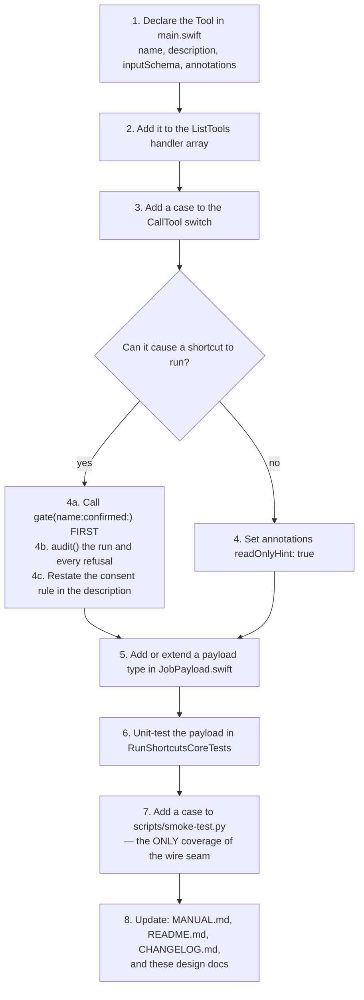

<!-- SPDX-License-Identifier: Apache-2.0 -->
# 8. Maintenance Guide

Practical instructions for changing this codebase, the traps that have already
bitten it once, and a field runbook.

## 8.1 Where things live

| I want to change… | Go to |
|-------------------|-------|
| A tool's name, description, or JSON schema | `Sources/RunShortcutsMCP/main.swift` — the six `Tool(...)` declarations |
| What a tool *does* | The matching `case` in the `CallTool` handler in `main.swift` |
| The allowlist file format | `Sources/RunShortcutsCore/Allowlist.swift` |
| Where the allowlist is found | `Sources/RunShortcutsCore/AllowlistLocator.swift` |
| First-run file layout | `Sources/RunShortcutsCore/ConfigProvisioner.swift` |
| Subprocess behaviour, timeouts, output caps | `Sources/RunShortcutsCore/ShortcutsRunner.swift` |
| Job scheduling, retention, the watchdog | `Sources/RunShortcutsCore/JobStore.swift` |
| A JSON response shape | `Sources/RunShortcutsCore/JobPayload.swift` (jobs) or `ShortcutsRunner.swift` (`RunOutput`) |
| What gets logged | `Sources/RunShortcutsCore/AuditEvent.swift` |
| The server-level `instructions` string | `main.swift`, `serverInstructions` |
| Bundle id, version stamping, entitlements | `packaging/Info.plist`, `packaging/RunShortcutsMCP.entitlements`, `scripts/build-app.sh` |
| The end-user manual | `assets/MANUAL.md` (rendered to HTML at build time — never edit the HTML) |

## 8.2 Adding a new MCP tool



**Non-negotiables for a tool that can execute a shortcut:**

- It goes through `gate(name:confirmed:)`. There is no second authorization path.
- Its description restates the consent rule explicitly — *obtain the user's
  approval first; never set `confirm=true` on your own initiative*. Client
  support for the server-level `instructions` is uneven, so nothing load-bearing
  may live only there.
- Its refusals produce an `AuditEvent` with a machine-readable `reason`.

## 8.3 Adding a bundled example shortcut

1. Export the `.shortcut` file into `assets/`.
2. Add its name to `EXAMPLE_SHORTCUTS` in `scripts/build-app.sh` **and** to
   `bundledShortcutNames` in `main.swift`. Both, or the file ships without being
   provisioned (or is provisioned without shipping).
3. Add an entry to `assets/RunShortcutsMCP.config.example` — unless it is a
   private subroutine like `GetSubTask`, which must be installed but never
   directly invoked, and is therefore deliberately absent from the example.
4. Document it in `assets/MANUAL.md` §3 and in
   [Configuration Reference §6.5](06-configuration.md).
5. Set `side_effect` honestly. The test is *does this change state the user cares
   about*, not *does it touch the disk* — `ShortcutBackup` writes files and is
   still `false`.

## 8.4 Known traps

### Trap 1 — `Value.doubleValue` returns `nil` for a whole number

The MCP SDK's `Value.doubleValue` matches only its `.double` case. A JSON literal
written without a decimal point (`20`) decodes as `.int`, and `doubleValue`
silently returns `nil`. Every real client sends whole numbers as bare integers.

**Always read numeric arguments through `numberValue(_:)`** in `main.swift`,
which tries both. This already shipped as a bug once.

### Trap 2 — `main.swift` is untestable

Top-level executable code cannot be imported by a test target. Anything you put
in `main.swift` is covered only by `scripts/smoke-test.py`. **Push logic down
into `RunShortcutsCore` wherever it can go**, and add a smoke-test case for
whatever must stay up top.

### Trap 3 — ObjC-bridged Foundation types are not `Sendable`

`ISO8601DateFormatter` is a mutable class. `JobPayload.swift` and
`AuditEvent.swift` each construct a **fresh formatter per call** rather than
caching one in a `static let`, precisely because these payloads may be built
concurrently across MCP requests. Do not "optimize" that into shared state.

The three recurring crossing points to check by inspection in any new concurrent
Swift here:

1. A cached `static let`/`static var` of a non-`Sendable` type → use a per-call
   factory instead.
2. A wrapper class used from more than one isolation domain → decide
   `Sendable`/`@unchecked Sendable` **when the class is written**, with a
   justification comment, not after the build fails.
3. A completion-handler API bridged via `withCheckedContinuation` → the callback
   is not guaranteed to run in the caller's isolation domain.

### Trap 4 — Do not measure durations with `Date`

Every elapsed-time decision reads the monotonic `uptime` closure.
`Job.submittedAt` exists **only** to be displayed. See
[Job Lifecycle §4.7](04-job-lifecycle.md) for the three regression tests that
exist because of this.

### Trap 5 — Client-facing errors must stay generic

A failure to launch reports `"Failed to run 'NAME'. See the server log for
details."` The underlying error goes to the audit log only (CWE-209). Do not
interpolate `error` into a client-facing string.

### Trap 6 — `Process.terminate()` semantics

Terminating a process that has **already exited** is a safe no-op. It raises
`NSInvalidArgumentException` only for one that was **never launched**. That is
why the attach-race path in `invoke` may call `process.terminate()` directly
after a successful `run()` without consulting `ProcessBox`. Signalling a raw PID
(`killIfRunning`) is the genuinely unsafe operation, and is guarded by
`liveTarget()`.

### Trap 7 — The allowlist is read once

Editing the config while the server runs changes nothing until the client
restarts it. If you ever add hot reload, work out first what it does to the
audit trail's ability to say which policy was in force for a given run.

## 8.5 Field runbook

| Symptom | Likely cause | Check |
|---------|--------------|-------|
| Server won't start; client shows it as failed | No allowlist resolved, or invalid JSON | The client's server log — startup writes an explicit reason to stderr before `exit(1)`. |
| `list_shortcuts` returns `[]` | Allowlist is the seeded empty default | `cat "~/Library/Application Support/dev.grumptech.runshortcutsmcp/RunShortcutsMCP.config"` |
| An entry shows `"installed": false` | Allowlisted but not present in the Shortcuts app | Run `shortcuts list` and compare the **exact** name, including case and spacing. |
| Every run refused with `not_allowlisted` | Name mismatch, or the client is pointed at a different config | Compare `list_shortcuts` output against what is being called; check for an `--allowlist` arg or `RUNSHORTCUTS_ALLOWLIST` overriding the standard path. |
| Runs refused with `needs_confirmation` repeatedly | Working as designed — the shortcut is `side_effect: true` | Either the assistant should ask the user, or the entry should be `false` if it genuinely changes nothing. |
| `run_shortcut` times out at ~60 s regardless of config | The **client's** request timeout, not this server's | Use `run_shortcut_async`. No server-side setting can change the client's ceiling. |
| A sync run times out but nothing seems to have happened | It timed out **while still queued** behind 4 running jobs | The result's stderr says so explicitly. Retrying is safe, even for a side-effecting shortcut. |
| `queue_full` refusals | 16 jobs queued or running | `list_shortcut_jobs`; wait, or cancel what is stuck. |
| `get_shortcut_result` says the output is no longer retained | Past the ~10-minute retention | The shortcut **did** run. Do not re-run it to recover output. |
| `get_shortcut_result` says unknown job id | Id never issued, or even the tombstone has aged out | `list_shortcut_jobs`. Never invent an id. |
| Output ends with `[runner] stdout truncated at N bytes.` | Hit the per-stream cap | Raise `max_output_bytes` for that entry (max 100 MB), or make the shortcut return less. |
| A shortcut hangs and the Shortcuts app appears | Shortcut is not headless — it is waiting on an interactive prompt | Remove the interactive action. Every allowlisted shortcut must be headless-safe. |
| Nothing in the log at all | The MCP client discards stderr | Check the client's logging. Claude Desktop keeps it under `~/Library/Logs/Claude/`. |

### Reading the audit log

```bash
grep '"event":"refused"' ~/Library/Logs/Claude/mcp-server-run-shortcuts.log
```

Two patterns worth watching for:

- A **burst of `not_allowlisted`** — a caller probing for shortcut names it was
  never given.
- A **`needs_confirmation` immediately followed by a confirmed run of the same
  shortcut** — the signature of the confirmation gate being self-answered rather
  than put to the user.

## 8.6 Code standards for this repository

From `CONTRIBUTING.md` and the project's own conventions:

- **Doc headers are required.** A file header on every file; a header on every
  function giving its purpose, each argument's type and description, the return's
  type and meaning, and any exceptions thrown. Public types and properties get a
  one-line description.
- **No inline comments narrating what the code does.** Comments explain *why*,
  and the non-obvious why is worth a paragraph — see `ProcessBox`'s doc comment
  for the standard.
- **No plan/process residue in code.** No milestone numbers, no "added in phase
  N", no plan section references. Code comments describe the code as it is.
- **`SPDX-License-Identifier: Apache-2.0`** at the top of every source and script
  file.
- **Tests for new logic by default.** Skip only for the genuinely trivial.
- **Never commit without the maintainer's explicit approval of the diff.**

## 8.7 Glossary

| Term | Meaning |
|------|---------|
| **MCP** | Model Context Protocol — the JSON-RPC protocol an assistant's client uses to talk to tool servers. |
| **Client** | The MCP client process (Claude Desktop, Claude Code) that launches this server and owns its lifecycle. |
| **Assistant** | The model driving that client. Trusted to *assert*, not to *verify*. |
| **Allowlist / config** | `RunShortcutsMCP.config` — the default-deny JSON policy file. The trust root. |
| **Gate** | `gate(name:confirmed:)` — the single authorization point both run tools pass through. |
| **`side_effect`** | Per-entry flag meaning "this changes state the user cares about"; requires `confirm: true`. |
| **Job** | One tracked background invocation, identified by `job_id` (`job_` + 8 hex characters). |
| **Slot** | One of four concurrency permits. Held only by a `running` job. |
| **Tombstone** | `ExpiredJob` — the memory that a retired job *ran*, kept after its output is gone. |
| **Reaping** | The retention pass (`reap()`) run at the top of every public `JobStore` accessor. |
| **Watchdog** | The 3630-second backstop that reclaims a slot from a job whose child ignores termination. |
| **TCC** | macOS Transparency, Consent and Control — the permission system that attributes automation access to a signed bundle identity. |
| **Notarization** | Apple's malware scan for Developer ID software, evidenced by a stapled ticket. |
